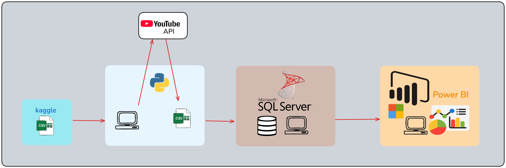
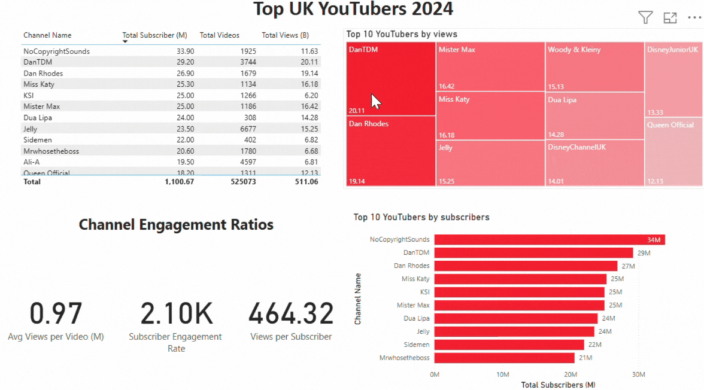

# Top UK Youtubers 2024

# Overview
This project analyzes the top YouTubers in the UK (2024) to assist a marketing team in selecting the best influencers. The data is extracted from **Kaggle** and **YouTube API**, processed using **Python**,  **SQL Server**, and visualized in **Power BI**.




# Table of contents 

- [Objective](#objective)
- [Data Source](#data-source)
- [Tools](#tools)
- [Data Processing](#data-processing)
- [SQL Data Cleaning](#sql-data-cleaning)
- [Power BI DAX Measures](#power-bi-dax-measures)
- [Power BI Dashboard](#power-bi-dashboard)

# Objective 

- What is the key pain point? 

The Head of Marketing wants to find out who the top YouTubers are in 2024 to decide on which YouTubers would be best to run marketing campaigns throughout the rest of the year.


- What is the ideal solution? 

To create a dashboard that provides insights into the top UK YouTubers in 2024 that includes their 
- subscriber count
- total views
- total videos, and
- engagement metrics

This will help the marketing team make informed decisions about which YouTubers to collaborate with for their marketing campaigns.


# User story 

As the Head of Marketing, I want to use a dashboard that analyses YouTube channel data in the UK . 

This dashboard should allow me to identify the top performing channels based on metrics like subscriber base and average views. 

With this information, I can make more informed decisions about which Youtubers are right to collaborate with, and therefore maximize how effective each marketing campaign is.

# Data source 

- What data is needed to achieve our objective?

We need data on the top UK YouTubers in 2024 that includes their 
- channel names
- total subscribers
- total views
- total videos uploaded


- Where is the data coming from? 
The data is sourced from Kaggle (an Excel extract), [see here to find it.](https://www.kaggle.com/datasets/bhavyadhingra00020/top-100-social-media-influencers-2024-countrywise?resource=download)

- Data is not completed! 
We extract additional data from YouTube API by giving channel ids from Kaggle

# Tools 

| Tool | Purpose |
| --- | --- |
| Excel | Exploring the data |
| Python | Pull data from YouTube API and use pandas to combine with original data |
| SQL Server | Cleaning, testing, and analyzing the data |
| Power BI | Visualizing the data via interactive dashboards |
| GitHub | Hosting the project documentation and version control |

# Data Processing
1. **Explore** data for structure, missing values, and inconsistencies.
2. **Clean & Transform**:
   - Extract relevant columns
   - Format channel names
   - Remove unnecessary columns
3. **Test & Validate**:
   - Row & column count checks
   - Data type consistency
   - Duplicate checks
4. **Visualize & Analyze**:
   - Build an **interactive Power BI dashboard**
   - Compute key **DAX measures**

# SQL Data Cleaning
```sql
-- Extract and clean YouTube channel data
SELECT
    SUBSTRING(NOMBRE, 1, CHARINDEX('@', NOMBRE) -1) AS channel_name,  
    total_subscribers,
    total_views,
    total_videos
FROM top_uk_youtubers_2024;

-- Create a SQL view for Power BI
CREATE VIEW view_uk_youtubers_2024 AS
SELECT
    CAST(SUBSTRING(NOMBRE, 1, CHARINDEX('@', NOMBRE) -1) AS VARCHAR(100)) AS channel_name,  
    total_subscribers,
    total_views,
    total_videos
FROM top_uk_youtubers_2024;
```

# Power BI DAX Measures
```
-- Total Subscribers (Millions)
Total Subscribers (M) = 
VAR million = 1000000
RETURN DIVIDE(SUM(view_uk_youtubers_2024[total_subscribers]), million)

-- Average Views Per Video (Millions)
Average Views per Video (M) = 
VAR sumViews = SUM(view_uk_youtubers_2024[total_views])
VAR sumVideos = SUM(view_uk_youtubers_2024[total_videos])
RETURN DIVIDE(sumViews, sumVideos, BLANK()) / 1000000

```

# Power BI Dashboard
